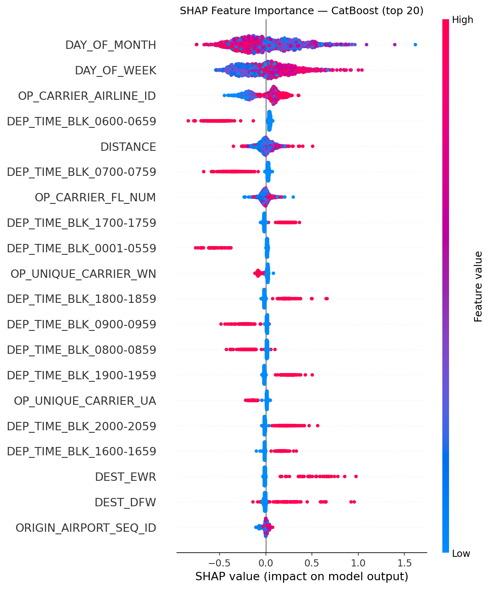
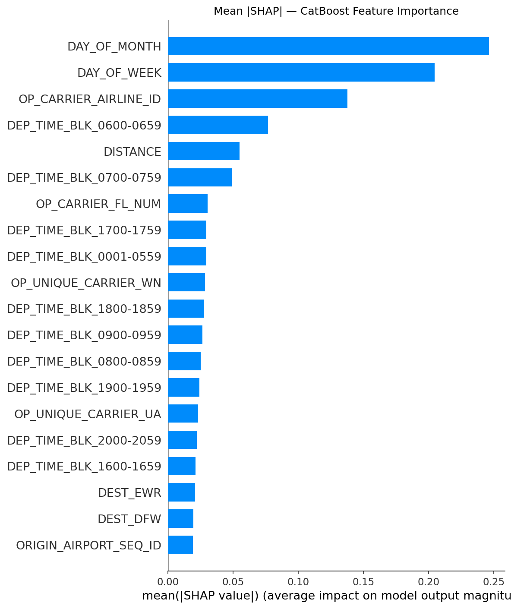

# ✈️ Flight Delay Prediction

A machine learning study predicting, **before a flight departs**, whether a US domestic flight will arrive **15 or more minutes late**, using January 2020 BTS On-Time Performance data (~600k flights). Three classifiers are benchmarked — Logistic Regression, Random Forest, and CatBoost — with SHAP analysis to explain what the winning model has learned.

> **Note:** this project originally contained a data leak (see below). The results in this README are the corrected, post-fix numbers. The leak and the fix are documented here deliberately, because catching and correcting it was as important to this project as the modelling itself.

---

## ⚠️ Data Leakage: What Happened and How It Was Fixed

The first version of this notebook dropped only the target column (`ARR_DEL15`) when building the feature matrix, and used everything else in the dataset as a predictor. That included several columns which are only known **after** a flight has already departed or landed:

| Leaked column | Why it's a problem |
|---|---|
| `DEP_DEL15` | The *actual* departure delay outcome — only known once the plane has pushed back. Extremely correlated with arrival delay (a flight that leaves late almost always arrives late), and was the dominant driver of the original model's performance. |
| `DEP_TIME` | The *actual* (not scheduled) departure time — also only known post-departure. |
| `ARR_TIME` | The *actual* arrival time — effectively adjacent to the target itself. |
| `CANCELLED` / `DIVERTED` | Post-flight outcome flags, not information available at prediction time. |

The result was a model that looked excellent (CatBoost AUC 0.96) but was secretly answering a much easier question than intended — "given that this flight already left late, will it arrive late?" — rather than the real task: "before this flight leaves, how likely is it to arrive late?"

**The fix:** these five columns were removed from the feature matrix alongside the target, leaving only information that is genuinely available before departure — scheduled departure time block, carrier, route, day of week/month, flight number, and distance.

### Before vs. after

| Model | Accuracy (leaked) | Accuracy (corrected) | AUC (leaked) | AUC (corrected) |
|---|---|---|---|---|
| Logistic Regression | 92.56% | 60.66% | 0.8965 | 0.66 |
| Random Forest | 92.46% | 84.79% | 0.9215 | 0.72 |
| CatBoost | 94.18% | 86.83% | 0.9588 | 0.75 |

The drop is large, and that's the point: it shows how much of the original "accuracy" was coming from information that wouldn't exist at prediction time in a real system. The corrected numbers are a more honest reflection of how predictable arrival delay actually is from pre-departure information alone.

---

## Results (corrected, pre-departure features only)

| Model | Accuracy | CV Accuracy | Precision | Recall | F1 | AUC |
|---|---|---|---|---|---|---|
| Logistic Regression | 60.66% | 60.72% | 19.45% | 59.37% | 29.30% | 0.66 |
| Random Forest | 84.79% | 84.78% | 31.07% | 8.85% | 13.77% | 0.72 |
| **CatBoost** | **86.83%** | 86.77% | **70.88%** | 6.98% | 12.71% | **0.75** |

> CatBoost has the best AUC and by far the best precision, but its recall is very low — it only flags a delay when it's fairly confident, and misses most true delays as a result. Logistic Regression (with `class_weight='balanced'`) trades precision for recall, catching more true delays at the cost of far more false alarms. Which of these is preferable depends entirely on the downstream use case, which is discussed below.

---

## Key Findings

**Pre-departure delay prediction is a genuinely hard problem.** Once departure-time information is removed, no model gets close to the ~0.96 AUC seen in the leaked version. An AUC of 0.72–0.75 is a more realistic ceiling for what's predictable from schedule, carrier, and route information alone — weather, air traffic control conditions, and upstream aircraft rotations (none of which are in this dataset) are the missing pieces that would likely close more of that gap.

**Precision/recall trade-off matters more than any single metric here.** Because delays are the minority class (~14% of flights), a model that predicts "on time" for everything already scores well on accuracy. CatBoost's high precision but low recall means it's conservative — good if the cost of a false alarm is high (e.g. unnecessarily rebooking passengers), but risky if missing a real delay is the more costly error (e.g. failing to pre-position ground crew or connecting-passenger support). Logistic Regression's opposite profile — many false alarms, but catching more real delays — would suit the reverse case.

**Class imbalance was addressed** using `class_weight='balanced'` on Logistic Regression and Random Forest; CatBoost handles it implicitly through its loss function. This is visible in the very different precision/recall balance between Logistic Regression and the two tree-based models.

**SHAP analysis on the corrected model** shows the leading signals are now legitimately pre-departure ones — distance, day of month/week, flight number, and carrier/route identity — rather than the departure-delay leak that dominated the original version's explanation.

---

## SHAP Analysis

SHAP (SHapley Additive exPlanations) values are used to explain CatBoost's predictions globally, using only the corrected (post-fix) feature set. The beeswarm plot shows the distribution of each feature's impact across 2,000 test samples; the bar chart ranks features by mean absolute SHAP value.




---

## Project Structure

```
Predicting-flight-delays/
│
├── notebook/
│   └── flight_delay_prediction.ipynb
│
├── images/
│   ├── shap_summary.png
│   └── shap_bar.png
│
└── README.md
```

---

## Data

Download the dataset from the [BTS On-Time Performance portal](https://www.transtats.bts.gov/DL_SelectFields.aspx?gnoyr_VQ=FGJ). Select January 2020 and place the file as `notebook/jan_2020_ontime.csv` before running the notebook.

The raw data file is excluded from this repository via `.gitignore`.

---

## Setup

```bash
pip install numpy pandas matplotlib scikit-learn catboost shap
```

Then open and run `notebook/flight_delay_prediction.ipynb` top to bottom.

---

## Methodology

- **Preprocessing:** One-Hot Encoding for categorical features (carrier, origin, destination, scheduled departure time block); StandardScaler for numeric features; stratified 80/20 train/test split
- **Leakage prevention:** post-departure columns (`DEP_DEL15`, `DEP_TIME`, `ARR_TIME`, `CANCELLED`, `DIVERTED`) are explicitly excluded from the feature matrix, alongside the target — see the *Data Leakage* section above for why
- **Class imbalance:** `class_weight='balanced'` for LR and RF; implicit handling in CatBoost
- **Evaluation:** Accuracy, 10-fold cross-validation, Precision, Recall, F1, AUC-ROC, Confusion Matrix
- **Explainability:** SHAP TreeExplainer on CatBoost (beeswarm + bar chart), computed on the corrected feature set

---

## Limitations & Future Work

- No weather data is included, despite it being one of the largest real-world drivers of delay — joining in historical weather at origin/destination around scheduled departure time (e.g. via a free NOAA or Open-Meteo API) would likely be the single highest-value addition.
- No engineered "cascading delay" features (e.g. how many prior flights that tail number has already flown that day, or historical delay rate for that specific route/carrier/hour combination), which could recover some of the signal lost by removing `DEP_DEL15`.
- Only January 2020 is used; delay patterns are seasonal, so results may not generalize to other months without retraining.
